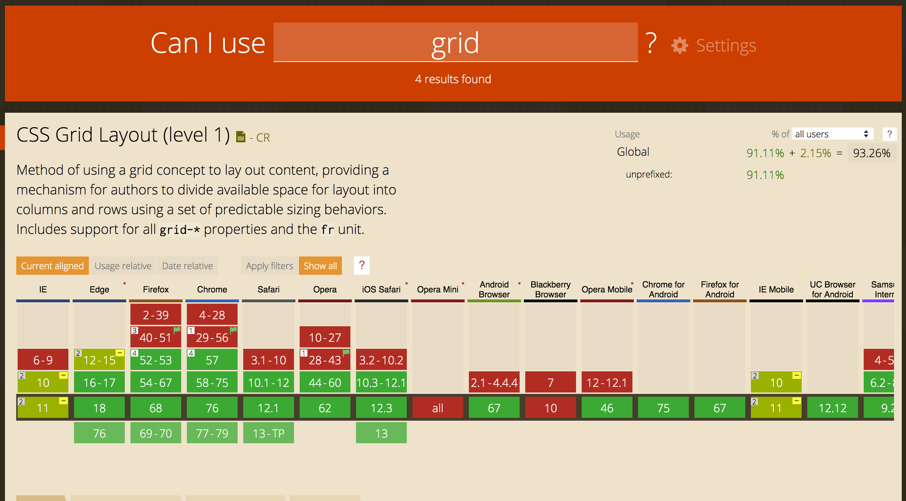

From the first time I heard about flexbox, I was hooked on it. It was finally really enjoyable to create layouts with CSS without hacking with floats and other methods. I haven't allocated time to really get into Grid, because of flexbox - but that is about to change.

## The Grid Spark

I was just about to leave for the day at work, when I saw a video on YouTube in my recommendations. A Grid Crash Course. I thought to myself I am gonna watch that video on the way home while commuting with the bus.

The video itself is 29 minutes long, but is very informative for a crash course on grid.

`youtube: https://www.youtube.com/watch?v=EFafSYg-PkI`

## Thoughts on CSS Grid

First I was skeptical about Grid and of the hype for it. I can do loads of layout styles with only flexbox and never thought of replacing it with Grid.

In the video, he is using Grid with Flex together and it seems to be a very powerful tool, and pretty well supported:

## Final Thoughts

I'm gonna get some experience with CSS Grid and try to rebuild some components on my personal website, replacing layouts created with flexbox to Grid.